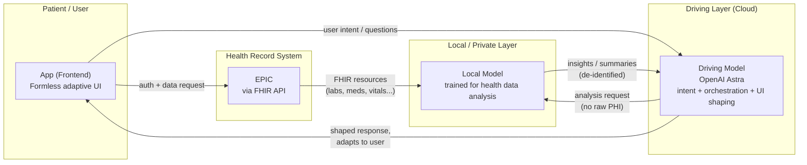

# Formless

## Inspiration

> "Empty your mind. Be formless, shapeless, like water. You put water into a cup; it becomes the cup. You put it into a teapot; it becomes the teapot." — Bruce Lee

For over 50 years, we've had to adapt to computers — learning their menus, their forms, their rigid abstractions. I wanted to flip that: software that 'takes the shape' of the person using it.

I started asking what a "formless" website or app would look like — one that, like water, takes on the most natural form for whoever and whatever it's serving. Healthcare felt like the sharpest place to test that idea given given my background, the increased need for accessibility and the fact that local models will soon allow us ot 

Technology could help far more people understand their own health, but accessibility and fragmented data make it hard for most people to actually use AI to see where they stand in their health journey today. Formless is our glimpse of that future: a tool that takes many forms, helps people safely access their own data, and uses safe or local models to help them understand and make progress.

## What it does

Formless is a tool for adaptive, "shapeless" software. We're starting with health as the first, most promising and hardest test case.

For health, Formless:
- Make it possible for the app to change form while remaining functional and secure
- Uses AI (local or otherwise privacy-safe models) to interpret that data
- Shapes its output — explanations, visualizations, next steps — to the person's specific situation, rather than forcing everyone through the same fixed dashboard (not demonstrated in the demo)

## How we built it

I wanted to build a real app that does something non-trivial, like pulling and visualizing real health data from EPIC. Security was top of mind so product for personal use only and no PHIs (sensitive health data) on any backend. The patient may decided to send data to be processed by an OpenAI model if they want.
Building blocks: Codex / Claude, WebContainer, NextJS, EPIC on FHIR, Vercel, WebMCP

## Challenges we ran into

- Getting real health data safely and legibly (formats, consent, access) without compromising privacy
- Designing an interface that's genuinely adaptive rather than just a different fixed layout
- Getting a local/safe model to explain health data accurately without overstepping into medical advice

## Accomplishments that we're proud of

- A working end-to-end app built part time in a few days
- Keeping the AI layer safe/local rather than routing sensitive health data through third parties
- Proving the "formless" concept works on a real, high-stakes domain, not just a toy example

## What's next for Formless

The real end goal splits reasoning from raw data access: a cloud "driving" model handles intent and orchestration, while a locally-trained model is the only component that ever touches raw patient data.
 

 
Personal health apps won't replace clinics, but over time they can close the knowledge gap between visits — helping people understand and act on their own data without needing a costly, centralized system to interpret it for them.
